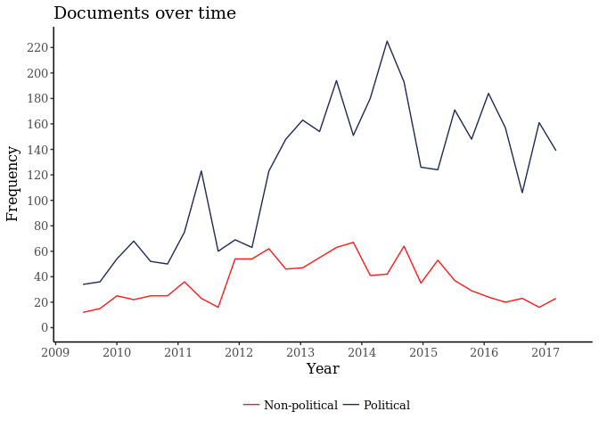
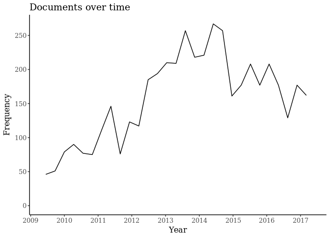
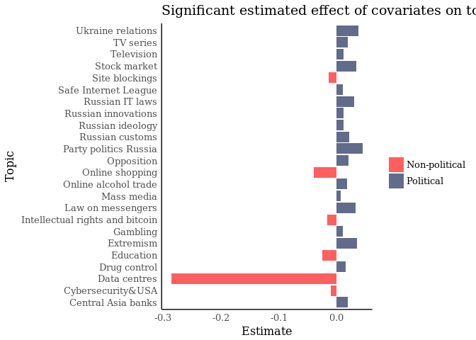
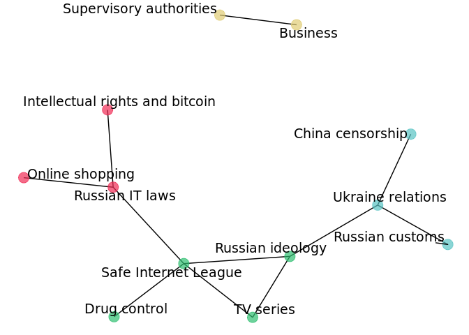
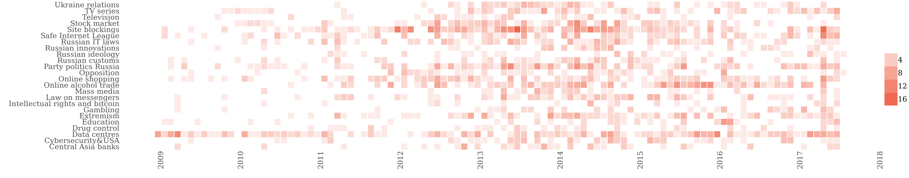
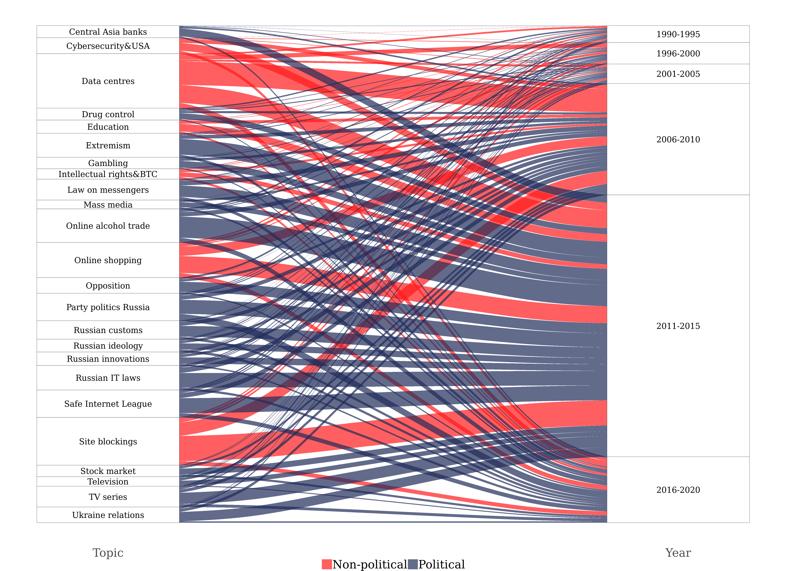
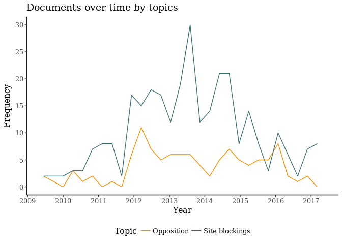

Internet regulation: A text-based approach to media coverage
================

Preparation
===========

Loading libraries
-----------------

``` r
library(jsonlite)
library(stringr)
library(tidyr)
library(dplyr)
library(widyr)
library(ggplot2)
library(data.table)
library(readr)
library(psych)
library(ggraph)
library(stm)
library(tm)
library(igraph)
library(lubridate)
library(scales)
library(ggalluvial)
library(alluvial)
```

Tidy text
---------

``` r
integrum = readLines("~/int_reg_rus/integrum_net_regulation_2.json") %>% 
  str_c(collapse = ",") %>%  #collapsing by comma into list objects
  (function(str) str_c("[", str, "]")) %>% #uniting list objects into list
  fromJSON(simplifyDataFrame = T) #convert into R object
 
df = as.data.frame(unlist(integrum)) #converting into data frame

setDT(df, keep.rownames = TRUE)[] #taking row names as a separate column
```

    ##             rn            unlist(integrum)
    ##     1: source1             Business Travel
    ##     2: source2             Business Travel
    ##     3: source3             Business Travel
    ##     4: source4 Connect. Мир связи (Москва)
    ##     5: source5 Connect. Мир связи (Москва)
    ##    ---                                    
    ## 65198:  na7241                           3
    ## 65199:  na7242                           3
    ## 65200:  na7243                           3
    ## 65201:  na7244                           1
    ## 65202:  na7245                           2

``` r
df$rn <- str_replace(df$rn, "[0-9]+", "") #removing digits in row names

colnames(df)[2] <- "values"
df$values <- as.character(df$values) #converting column with values into character 
```

``` r
df1 <- df %>%
   group_by(rn) %>% #grouping by names from first column
   mutate(ind = row_number()) %>% #creating id
   spread(rn, values) #making data frame with column names from first column
#write.csv(df1, file="~/media.csv", row.names=F)
```

``` r
df_dates <- df1
years_lst <- as.character(c(1900:2050))
df_dates$years <- gsub( ".*(\\d{4}).*", "\\1", df1$high_text)
df_dates <- df_dates %>% filter(years %in% years_lst)
df_dates <- df_dates %>% dplyr::select(ind, years)
```

``` r
#data cleaning for high text
df1$high_text <- str_replace_all(df1$high_text, "\n", " ")
df1$high_text <- str_replace_all(df1$high_text, "\r", " ")
df1$high_text <- str_replace_all(df1$high_text, "\\\\n", " ")
df1$high_text <- str_replace_all(df1$high_text, "[:punct:]", " ")
df1$high_text <- str_replace_all(df1$high_text, "[0-9]+", " ")
df1$high_text <- tolower(df1$high_text)
df1$high_text <- str_replace_all(df1$high_text, "[a-z]", " ")
df1$high_text <- str_replace_all(df1$high_text, "\\s+", " ") #deleting extra spaces (last)

high_text <- df1 %>% dplyr::select(high_text) #making new dataset for lemmatizing via mystem
#write.csv(high_text, file="~/high_text.csv", row.names=F)
#write.csv(df1, file="~/media_tidy.csv", row.names=F)
```

``` r
#reading lemmatized text which was lemmatized on desktop version of mystem
tolem_lem <- read_csv("~/int_reg_rus/tolem.lem.csv")
```

``` r
#attaching lemmatized text to the main dataset
df1 <- left_join(df1, tolem_lem, by="ind")
```

``` r
#Deleting Ukranian publishing house "Обозреватель"
#Uncertain name "Экономическая газета"
#Twins: 
#Недвижимость & цены / Недвижимость и цены
#Деловой вторник / Новый вторник
df1 <- df1 %>% filter(source != "Обозреватель")
```

``` r
#reading data on editors
sources <- read_csv("~/int_reg_rus/sources.csv")
colnames(sources)[2] <- "edited_main"
df_s <- left_join(df1, sources, by="edited_main")
```

``` r
#selecting impotant columns and making factors from polit oriented binary variable
df_s <- df_s %>% dplyr::select(high_text.y, Polit_news_related, date)
df_s$Polit_news_related <- as.factor(as.character(df_s$Polit_news_related))
```

``` r
col_p <- c("0"="#FF1B1C", "1"="#202C59")
df_s$date <- dmy(df_s$date)
df_s$date <- as.POSIXct(df_s$date, format = "%Y-%m-%d")
df_s$Polit_news_related <- as.character(df_s$Polit_news_related)
#png(filename="polit_docs_datetrp.png",width=1200, height=780)
ggplot(df_s, aes(x = as.Date(date, format = "%Y"), col=Polit_news_related)) + geom_freqpoly() +  theme_bw()+
  labs(x = "Year", y = "Frequency") +
  ggtitle("Documents over time") + scale_x_date(date_breaks = "1 year", date_labels = "%Y", limits = c(as.Date("2009-01-14", format="%Y"), as.Date("2017-08-02", format="%Y")))  + theme(text=element_text(family="Times New Roman", size=12), panel.grid.minor = element_blank(),panel.border = element_blank(), axis.line = element_line(colour = "black")) +
  scale_y_continuous(breaks = scales::pretty_breaks(n = 10))  + 
  scale_color_manual(name="", values=col_p, labels=c("0"="Non-political", "1"="Political")) + 
  theme(
    panel.background = element_rect(fill = "transparent") # bg of the panel
    , plot.background = element_rect(fill = "transparent") # bg of the plot
    , panel.grid.major = element_blank() # get rid of major grid
    , panel.grid.minor = element_blank(),
    legend.position = "bottom")
```



``` r
#dev.off()


#png(filename="pdocs_datetrp.png",width=1200, height=780)
ggplot(df_s, aes(x = as.Date(date, format = "%Y"))) + geom_freqpoly() +  theme_bw()+
  labs(x = "Year", y = "Frequency") +
  ggtitle("Documents over time") + scale_x_date(date_breaks = "1 year", date_labels = "%Y", limits = c(as.Date("2009-01-14", format="%Y"), as.Date("2017-08-02", format="%Y")))  + theme(text=element_text(family="Times New Roman", size=12), panel.grid.minor = element_blank(),panel.border = element_blank(), axis.line = element_line(colour = "black")) +
  scale_y_continuous(breaks = scales::pretty_breaks(n = 10))  + 
  theme(
    panel.background = element_rect(fill = "transparent") # bg of the panel
    , plot.background = element_rect(fill = "transparent") # bg of the plot
    , panel.grid.major = element_blank() # get rid of major grid
    , panel.grid.minor = element_blank(),
    legend.position = "bottom")
```



``` r
#dev.off()
```

``` r
#deleting stopwords
stopslova <- c(stopwords("ru"), "который", "этот", "что", "быть", "для", "весь", "как", "при", "свой", "только", "год")
stopslova <- str_pad(stopslova, 40, "both")
stopslova <- str_replace_all(stopslova, "\\s+", " ")

for (slovo in stopslova) {
  df_s[[1]] = str_replace_all(df_s[[1]], slovo, "")
}
```

STM
===

Model
-----

``` r
set.seed(1) 
#processed <- textProcessor(df_s$high_text.y, metadata = df_s, stem=F, removestopwords = TRUE, language = "ru")
load(file="~/int_reg_rus/processed30.RData")
load(file="~/int_reg_rus/out30.RData")

#out <- prepDocuments(processed$documents, processed$vocab, processed$meta)
#docs <- out$documents
#vocab <- out$vocab
#meta  <-out$meta 

#save(processed, file="~/int_reg_rus/processed30.RData")
#save(out, file="~/int_reg_rus/out30.RData")

#load(file="~/int_reg_rus/out30.RData")

#choosing number of opics, here less is better even if numbers show another point because 30 topics can be better interpreted
#set.seed(1) 
#storage <- searchK(out$documents, out$vocab, K = c(30, 50),  prevalence =~ Polit_news_related, data = out$meta)
#storage$results

#STM model
#set.seed(1) 
#poliblogPrevFit30 <- stm(documents = out$documents, vocab = out$vocab,
#                        K = 30, prevalence =~ Polit_news_related,
#                        max.em.its = 97, data = out$meta,
#                        init.type = "Spectral")

#save(poliblogPrevFit30, file='~/int_reg_rus/poliblogPrevFit30.RData')
load('~/int_reg_rus/poliblogPrevFit30.RData')
```

``` r
topicNames <- c("Opposition", "Education", "TV series", "Site blockings", "New markets for Russia", "China censorship", "Online shopping", "Russian innovations", "Gambling", "Supervisory authorities", "Social network sites", "Extremism", "Stock market", "Data centres", "Party politics Russia", "Ukraine relations", "Mass media", "Online alcohol trade", "Drug control", "Law on messengers", "Cybersecurity&USA", "Central Asia banks", "Russian IT laws", "Russian customs", "Television", "Online banking", "Business", "Russian ideology", "Intellectual rights and bitcoin", "Safe Internet League")

thirty_vec <- c(1:30)
names(thirty_vec) <- topicNames
thirty <- as.data.frame(cbind(thirty_vec, names(thirty_vec)))
colnames(thirty)[2] <- "names"
colnames(thirty)[1] <- "topic"
```

Estimated effect
----------------

``` r
prep2 <- estimateEffect(1:30 ~ Polit_news_related , poliblogPrevFit30,  meta = out$meta, uncertainty = "Global")
sumdf <- summary(prep2)
#getting data from the model
tblsum <- sumdf$tables

sign_topics <- as.data.frame(cbind(topic = topicNames, polit_true_sign = rep(NA, 30), estimate = rep(NA, 30)))
sign_topics$polit_true_sign = as.numeric(sign_topics$polit_true_sign)
sign_topics$estimate = as.numeric(sign_topics$estimate)

for (i in c(1:30)){
  sign_topics$polit_true_sign[[i]] = tblsum[[i]][2,4]
}

for (i in c(1:30)){
  sign_topics$estimate[[i]] = tblsum[[i]][2,1]
}

sign_topics$Group<-ifelse(sign_topics$polit_true_sign<=0.05,"Significant","Insignificant")
sign_topics$polit <- ifelse(sign_topics$estimate<0, "Non-political", "Political")
sign_topics <- sign_topics %>% filter(Group != "Insignificant")
cols <- c("Non-political"="#FF1B1C", "Political"="#202C59")
```

``` r
#this chart is not included in the paper
#plotting the proportion of texts for each covariated based on estimate and significance
#png(filename="effect.png",width=1350, height=980) #size=24
ggplot(sign_topics, aes(x=topic,y=estimate,fill=polit)) + 
  geom_bar(stat="identity", alpha=0.7) + 
  ylab("Estimate") + 
  xlab("Topic") + 
  ggtitle("Significant estimated effect of covariates on topics") +
  coord_flip() + 
  scale_fill_manual(name="", values=cols, breaks=c("Non-political", "Political")) +
  theme_minimal() + 
  theme(text=element_text(family="Times New Roman", size=12), panel.grid.major = element_blank(), panel.grid.minor = element_blank(),panel.border = element_blank(), axis.line = element_line(colour = "black"))
```



``` r
#dev.off()
```

``` r
#getting positive topic correlations
mod.out.corr <- topicCorr(poliblogPrevFit30)
adj_cor_topic <- mod.out.corr$posadj
adj_cor_topic_cor <- mod.out.corr$cor

#naming of row and columns of the matrix with topic names
adj_cor_topic <- as.matrix.data.frame(adj_cor_topic)
#colnames(adj_cor_topic) <- paste("Topic", 1:30, sep=" ")
#rownames(adj_cor_topic) <- paste("Topic", 1:30, sep=" ")
colnames(adj_cor_topic) <- topicNames
rownames(adj_cor_topic) <- topicNames

#getting igraph object from adjacency matrix
cor_topics <- graph.adjacency(adjmatrix = adj_cor_topic, mode = "undirected", diag = F)

#getting only connected nodes
cor_topics <- delete.vertices(cor_topics, 
            V(cor_topics)[ degree(cor_topics) < 1] )

fastgreedy_topic <- fastgreedy.community(cor_topics)

#getting membership as an attribute for nodes in network
table_fastgreedy_topic <- cbind(fastgreedy_topic$membership, fastgreedy_topic$names)
table_fastgreedy_topic = as.data.frame(table_fastgreedy_topic)

table_fastgreedy_topic$V1 = as.character(table_fastgreedy_topic$V1)
table_fastgreedy_topic$V2 = as.character(table_fastgreedy_topic$V2)

V(cor_topics)$Clusters = as.character(table_fastgreedy_topic$V1[match(V(cor_topics)$name, table_fastgreedy_topic$V2)])
```

Network of topics
-----------------

``` r
col_topics = c("1"="#2FBF71", "2"="#EF2D56", "3"="#59C3C3",  "4"="#DFCC74")
#png(filename="net_topics.png",width=1350, height=980) #size=24
ggraph(cor_topics, layout = "fr") +
  geom_edge_link(show.legend = FALSE) +
  geom_node_point(aes(color = Clusters), alpha = 0.7, size = 5, palette = "Set2") +
  geom_node_text(aes(label = name), repel = TRUE, size=5) +
  theme_void() +
  scale_color_manual(values=col_topics) +
  theme(legend.position="none", text=element_text(family="Times New Roman"))
```



``` r
#dev.off()
```

``` r
#matcging texts with the most probable topics
thetaDF <- as.data.frame(poliblogPrevFit30$theta) 
names(thetaDF) <- c(1:30)

toptopics <- as.data.frame(cbind(document = row.names(thetaDF), 
  topic = apply(thetaDF,1,function(x) names(thetaDF)[which(x==max(x))])))
```

Topics over time
----------------

``` r
# process string
toptopics <- left_join(toptopics, thirty, by="topic")
toptopics <- toptopics %>% dplyr::select(-topic)
colnames(toptopics)[2] <- "topic"
sign_topics$topic <- as.character(sign_topics$topic)
toptopics <- left_join(toptopics, sign_topics, by="topic")

dates <- df1 %>% dplyr::select(ind, date)
colnames(dates)[1] <- "document"
dates$document <- as.character(dates$document)
toptopics <- left_join(toptopics, dates, by="document")
toptopics$date <- dmy(toptopics$date)

toptopics_tile <- toptopics

toptopics_tile$date <- format(as.Date(toptopics_tile$date), "%Y-%m")
toptopics_heat <- toptopics_tile %>% dplyr::group_by(topic,date, polit) %>% dplyr::summarise(num_doc=n())
toptopics_heat$date <- paste0(toptopics_heat$date, "-1")

toptopics_heat$date <- as.POSIXct(toptopics_heat$date, format = "%Y-%m-%d", tz = "UTC") 
toptopics_heat <- na.omit(toptopics_heat)

colfunc <- colorRampPalette(c("white", "#F06449"))

toptopics_heat <- left_join(toptopics_heat, thirty, by="topic")

#png(filename="date_distr.png",width=5000, height=980) #size=24
toptopics_heat %>% ggplot(aes(date, topic,  fill = num_doc)) +
  geom_tile(color="white")  + 
  scale_fill_gradientn(name="", colors = colfunc(9), trans = "sqrt", na.value = 'grey50')  +
  theme_minimal() + theme(panel.grid = element_blank()) +
  ylab("") +
  xlab("") +
  theme(text=element_text(family="Times New Roman", size=50), axis.text.x = element_text(angle = 90, hjust = 1), legend.text=element_text(size=40)) + scale_x_continuous(expand=c(0,0)) + scale_x_datetime(date_breaks = "1 year", labels = date_format("%Y")) + guides(fill=guide_legend(keywidth=1, keyheight=1, default.unit="inch")) 
```



``` r
#dev.off()
```

Years; mentions in topics
-------------------------

``` r
topics <- toptopics_tile
colnames(df_dates)[1] <- "document"
df_dates$document <- as.factor(df_dates$document)
topic_dates <- left_join(df_dates, topics, by="document")
topic_dates <- topic_dates %>% group_by(topic, years) %>% summarise(count=n())
topic_dates <- left_join(topic_dates, sign_topics, by="topic")
topic_dates <- na.omit(topic_dates)
topic_dates <- topic_dates %>% dplyr::select(topic, years, polit, count)

topic_dates <- as.data.frame(topic_dates)

topic_dates$topic <- as.factor(as.character(topic_dates$topic))
topic_dates$polit <- as.factor(as.character(topic_dates$polit))
topic_dates$count <- as.numeric(topic_dates$count)

topic_dates$years <- as.numeric(as.character(topic_dates$years))

topic_dates <- topic_dates %>% filter(years %in% c(1990:2020))

topic_dates$years[topic_dates$years %in% c(1990:1995)] <- "1990-1995"
topic_dates$years[topic_dates$years %in% c(1996:2000)] <- "1996-2000"
topic_dates$years[topic_dates$years %in% c(2001:2005)] <- "2001-2005"
topic_dates$years[topic_dates$years %in% c(2006:2010)] <- "2006-2010"
topic_dates$years[topic_dates$years %in% c(2011:2015)] <- "2011-2015"
topic_dates$years[topic_dates$years %in% c(2016:2020)] <- "2016-2020"


topic_dates$years <- as.factor(as.character(topic_dates$years))
```

``` r
topic_dates <- left_join(topic_dates, thirty, by="topic")
topic_dates$topic[topic_dates$topic == "Intellectual rights and bitcoin"] <- "Intellectual rights&BTC"
```

``` r
#png(filename="years_links.png",width=5500, height=4000) #size=24
ggplot(data=as.data.frame(topic_dates), aes(weight = (topic_dates$count), axis1 = (topic_dates$topic), axis2 = (topic_dates$year))) +
  geom_alluvium(aes(fill = topic_dates$polit), width = 1/4, alpha=0.7) +
  geom_stratum(width = 1/4, height = 0.5) +
  geom_text(stat = "stratum", label.strata = TRUE, size=20, family="Times New Roman") +
  scale_x_continuous(breaks = 1:2, labels = c("Topic", "Year")) +
  scale_fill_manual(name="", values=cols) +
  theme_minimal() +
  theme(text=element_text(family="Times New Roman", size=80), axis.text.x = element_text(size=80),
        axis.text.y = element_blank(), panel.grid.major = element_blank(), panel.grid.minor = element_blank(), panel.background = element_blank(), legend.text=element_text(size=80),
    legend.position = "bottom") + guides(fill=guide_legend(keywidth=1, keyheight=1, default.unit="inch")) 
```



``` r
#dev.off()
```

``` r
toptopics <- toptopics %>% filter(topic %in% c("Site blockings", "Opposition"))
toptopics$date <- format(as.Date(toptopics$date), "%Y-%m-%d")
toptopics <- toptopics %>% group_by(date, topic) %>% summarise(num_doc=n())

toptopics$date <- as.POSIXct(toptopics$date, format = "%Y-%m-%d", tz = "UTC") 
toptopics <- na.omit(toptopics)


col_opp = c("Site blockings" = "#3C6E71", "Opposition" = "#F18F01")
lt = c("Site blockings" = "dashed", "Opposition" = "solid")

#png(filename="block_oppos.png",width=1200, height=780)
ggplot(toptopics, aes(x = as.Date(date, format = "%Y"), col=topic)) + geom_freqpoly() +  theme_bw()+
  labs(x = "Year", y = "Frequency") +
  ggtitle("Documents over time by topics") + scale_x_date(date_breaks = "1 year", date_labels = "%Y", limits = c(as.Date("2009-02-13", format="%Y"), as.Date("2017-08-02", format="%Y")))  + theme(text=element_text(family="Times New Roman", size=12), panel.grid.minor = element_blank(),panel.border = element_blank(), axis.line = element_line(colour = "black")) +
  scale_y_continuous(breaks = scales::pretty_breaks(n = 10))  + 
  scale_colour_manual(name="Topic", values=col_opp) +
  theme(
    panel.background = element_rect(fill = "transparent") # bg of the panel
    , plot.background = element_rect(fill = "transparent") # bg of the plot
    , panel.grid.major = element_blank() # get rid of major grid
    , panel.grid.minor = element_blank(),
    legend.position = "bottom")
```



``` r
#dev.off()
```
