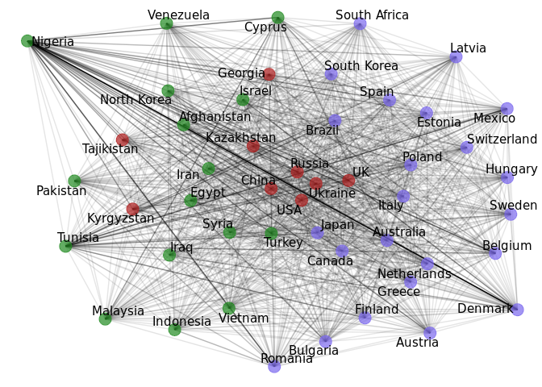

Internet regulation in Russia: Topics and Countries
================

Preparation
===========

Loading libraries
-----------------

Tidy text
---------

    ##             rn            unlist(integrum)
    ##     1: source1             Business Travel
    ##     2: source2             Business Travel
    ##     3: source3             Business Travel
    ##     4: source4 Connect. Мир связи (Москва)
    ##     5: source5 Connect. Мир связи (Москва)
    ##    ---                                    
    ## 65198:  na7241                           3
    ## 65199:  na7242                           3
    ## 65200:  na7243                           3
    ## 65201:  na7244                           1
    ## 65202:  na7245                           2

``` r
df1 <- df %>%
   group_by(rn) %>% #grouping by names from first column
   mutate(ind = row_number()) %>% #creating id
   spread(rn, values) #making data frame with column names from first column
#write.csv(df1, file="~/media.csv", row.names=F)
```

``` r
#data cleaning for high text
df1$high_text <- str_replace_all(df1$high_text, "\n", " ")
df1$high_text <- str_replace_all(df1$high_text, "\r", " ")
df1$high_text <- str_replace_all(df1$high_text, "\\\\n", " ")
df1$high_text <- str_replace_all(df1$high_text, "[:punct:]", " ")
df1$high_text <- str_replace_all(df1$high_text, "[0-9]+", " ")
df1$high_text <- tolower(df1$high_text)
df1$high_text <- str_replace_all(df1$high_text, "[a-z]", " ")
df1$high_text <- str_replace_all(df1$high_text, "\\s+", " ") #deleting extra spaces (last)

high_text <- df1 %>% select(high_text) #making new dataset for lemmatizing via mystem
#write.csv(high_text, file="~/high_text.csv", row.names=F)
#write.csv(df1, file="~/media_tidy.csv", row.names=F)
```

``` r
#reading lemmatized text which was lemmatized on desktop version of mystem
tolem_lem <- read_csv("~/int_reg_rus/tolem.lem.csv")
```

``` r
#attaching lemmatized text to the main dataset
df1 <- left_join(df1, tolem_lem, by="ind")
```

``` r
#Deleting Ukranian publishing house "Обозреватель"
#Uncertain name "Экономическая газета"
#Twins: 
#Недвижимость & цены / Недвижимость и цены
#Деловой вторник / Новый вторник
df1 <- df1 %>% filter(source != "Обозреватель")
```

Countries exraction
-------------------

``` r
#reading file with names of countries
countries = read.table("~/int_reg_rus/name_contrs.txt", 
               sep="\t", 
               col.names=c("name"), 
               fill=FALSE, 
               strip.white=TRUE)
```

``` r
#making names of countries lower case and adding spaces before and after every name
countries$name <- tolower(countries$name)
countries <- str_pad(countries$name, 40, "both")
countries <- str_replace_all(countries, "\\s+", " ")
```

``` r
dt_contr <- select(df1, high_text.y, ind)

#extracting countries from lemmatized texts
for (country in countries) {
  dt_contr[[country]] = str_count(dt_contr[[1]], country)
}
```

``` r
#making dataframe with three columns where vlue is count of particular country in particular text, ind - id of the text, country - names of countries
dt_gath <- dt_contr %>% gather(country, value, -ind) %>% na.omit() %>% arrange(ind)
dt_gath$value <- as.numeric(dt_gath$value)
dt_gath$ind <- as.character(dt_gath$ind)

#deleting not countries and renming the same countries
dt_gath <- dt_gath %>% dplyr::filter(country != "high_text.y", country!=" ес ", country!=" оон ", value>0)
dt_gath$country[dt_gath$country == " беларусь "] <- " белоруссия "
dt_gath$country[dt_gath$country == " великобритания "] <- " англия "
dt_gath$country[dt_gath$country == " кндр "] <- " северный корея "
```

``` r
#deleting al whitespaces in names of countries
dt_gath$country <- str_replace_all(dt_gath$country, "\\s+", "")

#translating russian names of countries into english
dt_gath$country <- recode(dt_gath$country, "румыния" = "Romania", "болгария" = "Bulgaria", "эстония" = "Estonia", "венгрия" = "Hungary", "латвия"= "Latvia", "англия" = "UK", "греция" = "Greece", "польша" = "Poland", "италия" = "Italy", "испания"= "Spain","дания" = "Denmark", "австрия" = "Austria", "бельгия" = "Belgium", "швейцария" = "Switzerland", "нидерланды" = "Netherlands", "швеция" = "Sweden", "юар" = "South Africa", "бразилия" = "Brazil", "мексика" = "Mexico", "япония" = "Japan", "канада" = "Canada", "австралия" = "Australia", "северныйкорея" = "North Korea", "южныйкорея"="South Korea", "финляндия" = "Finland", "кипр" = "Cyprus","нигерия" = "Nigeria", "венесуэла" = "Venezuela", "малайзия" = "Malaysia", "индонезия" = "Indonesia", "вьетнам" = "Vietnam", "афганистан" = "Afghanistan", "израиль" = "Israel", "турция" = "Turkey", "египет" = "Egypt", "тунис" = "Tunisia", "иран" = "Iran", "сирия" = "Syria","ирак"=  "Iraq","пакистан" = "Pakistan", "казахстан" = "Kazakhstan", "великобритания" = "UK", "украина" = "Ukraine", "сша" = "USA", "россия" = "Russia", "китай" = "China", "грузия" = "Georgia", "таджикистан" = "Tajikistan", "киргизия" = "Kyrgyzstan")

#getting countries which occure more that 120 times
texts_countr_max <- dt_gath %>% group_by(country) %>% summarise(n = n()) %>% filter(n>120) %>% arrange(desc(n))
```

Networks of countries
=====================

Countries correlation network
-----------------------------

``` r
#reading csv with ids of documents and the country which was the most popular 
med_drug_top <- read.csv(file="~/int_reg_rus/top_countries.csv")
med_drug_top$ind <- as.factor(as.character(med_drug_top$ind))

#calculating pairwise correlation (phi-coefficient)
word_cors <- med_drug_top %>%
  pairwise_cor(country, ind, sort = TRUE)

#calculating number of observations to get calulate significant correlations
count.pairwise(med_drug_top, diagonal = F)
```

    ##           ind country
    ## ind        NA   12501
    ## country 12501      NA

``` r
#getting 3d quantile of correlation between countries to set a threshold
quantile(word_cors$correlation)
```

    ##          0%         25%         50%         75%        100% 
    ## -0.14271475  0.04773744  0.08059974  0.12612592  0.49158403

``` r
round(mean(filter(word_cors, correlation >= 0.12612592)$correlation), 1)
```

    ## [1] 0.2

``` r
#filtering only countries with correlation more than 0.2
wc33 <- word_cors %>%
  filter(correlation > .2)

#deleting duplicated edges
wc33 <- wc33[!duplicated(apply(wc33,1,function(x) paste(sort(x),collapse=''))),]

#making non-directed graph
wcc22 = wc33 %>% graph_from_data_frame(directed=F)

#applying fast greedy algorithm
kc <- fastgreedy.community(wcc22)

#getting membership as an attribute for nodes in network
table <- cbind(kc$membership, kc$names)
table = as.data.frame(table)

table$V1 = as.character(table$V1)
table$V2 = as.character(table$V2)

V(wcc22)$Clusters = as.character(table$V1[match(V(wcc22)$name, table$V2)])
```

``` r
col_net <-c("1" = "#DC143C", "6" = "#6495ED", "5" = "#556B2F", "4" = "#6A5ACD", "3" = "#FFD700", "2" = "#FF8C00")
#plotting network with ggraph
ggraph(wcc22, layout = "fr") +
  geom_edge_link(aes(edge_alpha = correlation), show.legend = FALSE) +
  geom_node_point(aes(color = Clusters), alpha = 0.7, size = 5, palette = "Set2") +
  geom_node_text(aes(label = name), repel = TRUE) +
  theme_void() +
  scale_color_manual(values=col_net) +
  theme(legend.position="none")
```


Countries co-occurences network
-------------------------------

    ## [1] TRUE

``` r
#deleting verticles with degree less than 100
sgdf.copy <- delete.vertices(symt_graph, 
            V(symt_graph)[ degree(symt_graph) < 100] )

#applying fastgreedy algorithm
fastgreedy_main <- fastgreedy.community(sgdf.copy)
eb <- edge.betweenness(sgdf.copy)
l <- layout.auto(sgdf.copy)
#making custom palette
med <- colorRampPalette(c("#228B22", "#7B68EE", "#B22222"))
colors <- med(max(membership(fastgreedy_main)))
colors_frame <- med(max(membership(fastgreedy_main)))
```

``` r
#png(filename="TNR_net_countr.png",width=2560, height=1600) #saving plots, add vertex.label.cex = 3
#plotting the network
set.seed(1)
plot(sgdf.copy, vertex.label.cex = 0.75, vertex.label.color="black", vertex.size=degree(sgdf.copy)/10, vertex.color=colors[membership(fastgreedy_main)], vertex.frame.color=colors_frame[membership(fastgreedy_main)], edge.width=eb/20, layout=l)
```



``` r
#dev.off()
```

``` r
#plotting the tree
set.seed(1)
ceb <- cluster_fast_greedy(sgdf.copy) 
#png(filename="TNR_dend_countr.png",width=1280, height=780) #add cex=2
par(mar=c(5, 6, 4, 1), cex=0.75, family="Times")
dendPlot(ceb, mode="hclust", colbar=c("#7B68EE", "#B22222", "#228B22"))
```


``` r
#dev.off()
```

Structural topic modeling
=========================

Preparing covariates
--------------------

    ##             rn unlist(fastgreedy_main)
    ##   1:   merges1                      13
    ##   2:   merges2                      49
    ##   3:   merges3                      14
    ##   4:   merges4                      15
    ##   5:   merges5                      11
    ##  ---                                  
    ## 236:   names46               Indonesia
    ## 237:   names47                  Mexico
    ## 238:   names48                 Nigeria
    ## 239: algorithm             fast greedy
    ## 240:    vcount                      48

``` r
clusters_country <- clusters_country %>%
   group_by(rn) %>% #grouping by names from first column
   mutate(ind = row_number()) %>% #creating id
   spread(rn, values) #making data frame with column names from first column

clusters_country <- clusters_country %>% select(membership, names) %>% na.omit()
colnames(clusters_country)[2] <- "country"
```

``` r
#assign numbers of clusters for texts
text_by_country <- dt_gath %>% group_by(ind) %>% slice(which.max(value))
text_by_country <- left_join(text_by_country, clusters_country, by = "country")
text_by_country$membership[is.na(text_by_country$membership)] <- 4 #cluster of texts which mention low degree countries
text_by_country$ind <- as.numeric(text_by_country$ind)
texts_clusters <- left_join(df1, text_by_country, by = "ind")
texts_clusters$membership[is.na(texts_clusters$membership)] <- 5 #cluster of texts which do not mention countries at all
```

Plots with covariates
---------------------

``` r
#getting number of texts per country and their nenbership
top_contr <- as.data.frame(texts_clusters) %>% select(country, membership, -ind) %>%  group_by(country, membership) %>% count()  %>%  arrange(desc(n)) %>% na.omit() %>% head(11)%>% filter(country!="Russia")
topc <- c(top_contr$country)
cols <- c("2" = "#228B22", "1" = "#7B68EE", "3" = "#B22222", "4" = "#DAA520")
```

``` r
#png(filename="TNR_distr_countr_textstrp.png",width=1350, height=780, bg="transparent") #size=25 and size=5
#plotting proportion of countries-oriented texts and percent from Russia-oriented texts
ggplot(data=top_contr, aes(x=reorder(as.factor(country), -n), y=n, fill=top_contr$membership))+
  geom_bar(stat="identity", alpha=0.7)+theme_bw()+
  xlab("Country")+
  ylab("Number of documents")+
  ggtitle("Distribution of countries in country oriented texts\nwith a percentage of the number of texts about Russia")+
  coord_flip()+
  scale_fill_manual(values=cols, name="Membership", labels = c("Developing countries\n(including countries of\nthe Arab spring)", " \nDeveloped countries\n ", " \nCore countries\n ")) + 
  geom_text(aes(x=country, y=round((n/3368)*100, 1), label=paste(round((n/3368)*100, 1), "%", ""), hjust=ifelse(sign(round((n/3368)*100, 1))>0, 0, 0)), position = position_dodge(width=1), size = 5) + 
  theme(text=element_text(family="Times New Roman", size=12, color="black"), panel.grid.major = element_blank(), panel.grid.minor = element_blank(),panel.border = element_blank(), axis.line = element_line(colour = "black"))+ theme(
    panel.background = element_rect(fill = "transparent") # bg of the panel
    , plot.background = element_rect(fill = "transparent") # bg of the plot
    , panel.grid.major = element_blank() # get rid of major grid
    , panel.grid.minor = element_blank() # get rid of minor grid
    , legend.background = element_rect(fill = "transparent") # get rid of legend bg
    , legend.box.background = element_rect(fill = "transparent") # get rid of legend panel bg
  )
```


``` r
#dev.off()
```

STM and networks of topics
--------------------------

``` r
texts_clusters <- as.data.frame(texts_clusters)
texts_clusters <- texts_clusters %>% select(ind, high_text.y, membership)
texts_clusters$membership <- as.factor(as.character(texts_clusters$membership))

#deleting stopwords
stopslova <- c(stopwords("ru"), "который", "этот", "что", "быть", "для", "весь", "как", "при", "свой", "только", "год")
stopslova <- str_pad(stopslova, 40, "both")
stopslova <- str_replace_all(stopslova, "\\s+", " ")

for (slovo in stopslova) {
  texts_clusters[[2]] = str_replace_all(texts_clusters[[2]], slovo, "")
}

#text processing
#processed <- textProcessor(texts_clusters$high_text.y, metadata = texts_clusters, stem=F, removestopwords = TRUE, language = "ru")
#out <- prepDocuments(processed$documents, processed$vocab, processed$meta)
#docs <- out$documents
#vocab <- out$vocab
#meta  <-out$meta 

#save(processed, file="~/int_reg_rus/processed.RData")
#save(out, file="~/int_reg_rus/out.RData")

load(file="~/int_reg_rus/processed.RData")
load(file="~/int_reg_rus/out.RData")
docs <- out$documents
vocab <- out$vocab
meta  <-out$meta 

#STM model
#set.seed(1) 
#poliblogPrevFit <- stm(documents = out$documents, vocab = out$vocab,
#                        K = 50, prevalence =~ membership,
#                        max.em.its = 200, data = out$meta,
#                        init.type = "Spectral") #83 iterations

#save(poliblogPrevFit, file='~/int_reg_rus/poliblogPrevFit.rda')
#save(poliblogPrevFit, file='~/int_reg_rus/poliblogPrevFit.RData')

#loading finished model
load('~/int_reg_rus/poliblogPrevFit.RData')
#poliblogPrevFit$convergence
```

``` r
#deleting removed while preprocessing texts from the main dataset
rem <- as.data.frame(processed$docs.removed)
colnames(rem)[1] <- "ind"
texts_clusters$ind <- 1:nrow(texts_clusters)
without_removed <- anti_join(texts_clusters, rem, by="ind")
```

``` r
topicNames <- c("editorial\npositions\nchanges", "congresses&\nexhibitions", " \n \nOrthodoxy", "website\nblocking", "Egypt\nrelations", "China\n      censorship", "internet\ntrading", "import\nsubstitution", "gambling", "state&law", "social-network\nsites", "Internet\nfor children", "large\ncompanies", "business\ninformation\nmanagement", "president\nelections", "Ukraine&Turkey\nrelations", "online\npolitical\nopposition", "ban on the distant\nsale of alcohol", "extremism", "Telegram\nprohibition", "cybersecurity&\nUSA", "TV-programs", "law\n      modernization", "Dayton\nagreements", "new Internet\nrules for individuals\n ", "telemedicine", "cadastral\nregulation", "political\nregime&ideology", "WikiLeaks", "antivirus\nsoftware", "banking\nsystem\nautomation", "utilities\nprices", "agriculture", "Moscow renovation\nprogram", "international\ntrade law", "crypto-currency\nmining", "criminal\nprosecution", "casino", "e-banks", "federal\ncivil law", "criminal\ncases", "piracy", "Kinotavr", "ban on tobacco\nadvertising", "China\nrelations", "Unified Domain\nName Registry", "legal\nregulation", "Telecom Ministry", "finance", "anti-piracy law")

topicNames_streight <- c("editorial positions changes", "congresses & exhibitions", "Orthodoxy", "website blocking", "Egypt relations", "China censorship", "internet trading", "import substitution", "gambling", "state & law", "social-network sites", "Internet for children", "large companies", "business information management", "president elections", "Ukraine&Turkey relations", "online political opposition", "ban on the distant sale of alcohol", "extremism", "Telegram prohibition", "cybersecurity & USA", "TV-programs", "law modernization", "Dayton agreements", "new Internet rules for individuals", "telemedicine", "cadastral regulation", "political regime & ideology", "WikiLeaks", "antivirus software", "banking system automation", "utilities prices", "agriculture", "Moscow renovation program", "international trade law", "crypto-currency mining", "criminal prosecution", "casino", "e-banks", "federal civil law", "criminal cases", "piracy", "Kinotavr", "ban on tobacco advertising", "China relations", "Unified Domain Name Registry", "legal regulation", "Telecom Ministry", "finance", "anti-piracy law")

fift_slash <- c(1:50)
names(fift_slash) <- topicNames

fift <- c(1:50)
names(fift) <- topicNames_streight
```

``` r
#getting positive topic correlations
mod.out.corr <- topicCorr(poliblogPrevFit)
adj_cor_topic <- mod.out.corr$posadj
adj_cor_topic_cor <- mod.out.corr$cor

#naming of row and columns of the matrix with topic names
adj_cor_topic <- as.matrix.data.frame(adj_cor_topic)
colnames(adj_cor_topic) <- paste("Topic", 1:50, sep=" ")
rownames(adj_cor_topic) <- paste("Topic", 1:50, sep=" ")
colnames(adj_cor_topic) <- topicNames
rownames(adj_cor_topic) <- topicNames

#getting igraph object from adjacency matrix
cor_topics <- graph.adjacency(adjmatrix = adj_cor_topic, mode = "undirected", diag = F)

#getting only connected nodes
cor_topics <- delete.vertices(cor_topics, 
            V(cor_topics)[ degree(cor_topics) < 1] )

fastgreedy_topic <- fastgreedy.community(cor_topics)

l <- layout.auto(cor_topics)
med <- colorRampPalette(c("#DAA520", "#008000", "#C71585",  "#FF6347", "#191970", "#DC143C",  "#008080", "#87CEFA", "#EE82EE", "#FF4500"))
colors <- med(max(membership(fastgreedy_topic)))
colors_frame <- med(max(membership(fastgreedy_topic)))
```

``` r
#plotting network of positive significant correlations between topics
#png(filename="TNR_corr_topics.png",width=6000, height=3500) #vertex.label.cex = 4
par(family="Times")
plot(cor_topics, vertex.label.cex = 1, vertex.label.color="black", vertex.size=5, vertex.color=colors[membership(fastgreedy_topic)], vertex.frame.color=colors_frame[membership(fastgreedy_topic)], layout=l, vertex.label.dist=0.5)
```


``` r
#dev.off()
```

``` r
#matcging texts with the most probable topics
thetaDF <- as.data.frame(poliblogPrevFit$theta) 
names(thetaDF) <- c(1:50)

toptopics <- as.data.frame(cbind(document = row.names(thetaDF), 
  topic = apply(thetaDF,1,function(x) names(thetaDF)[which(x==max(x))])))
```

Plots on the main data
======================

Plots with documents
--------------------

``` r
#taking the main dataset to work with dates
dt <- df1
dt$date <- substr(dt$date, start = 1, stop = 10)
dt$date <- dmy(dt$date)
```

``` r
dt$ind <- 1:nrow(dt)
date_ind <- dt %>% select(ind, date)
colnames(toptopics)[1] <- "ind"
toptopics$ind <- as.numeric(as.character(toptopics$ind))
toptopics_date <- left_join(toptopics, date_ind, by="ind")
```

``` r
#png(filename="TNR_docs_datetrp.png",width=1200, height=780, bg="transparent") #size=24
ab <- ggplot(toptopics_date, aes(x = as.Date(date, format = "%Y")))
ab + geom_freqpoly() +  theme_bw()+
  labs(x = "Year", y = "Frequency") +
  ggtitle("Documents over time") + scale_x_date(date_breaks = "1 year", date_labels = "%Y", limits = c(as.Date("2009-01-14", format="%Y"), as.Date("2017-08-02", format="%Y")))  + theme(text=element_text(family="Times New Roman", size=12), legend.position="bottom", panel.grid.minor = element_blank(),panel.border = element_blank(), axis.line = element_line(colour = "black")) +
  scale_y_continuous(breaks = scales::pretty_breaks(n = 10)) + theme(
    panel.background = element_rect(fill = "transparent") # bg of the panel
    , plot.background = element_rect(fill = "transparent") # bg of the plot
    , panel.grid.major = element_blank() # get rid of major grid
    , panel.grid.minor = element_blank() # get rid of minor grid
    , legend.background = element_rect(fill = "transparent") # get rid of legend bg
    , legend.box.background = element_rect(fill = "transparent") # get rid of legend panel bg
  )
```


``` r
#dev.off()
```

Plots with countries
--------------------

``` r
#plotting number of cuntries' mentions
ggplot(data=texts_countr_max, aes(x=reorder(as.factor(country), -n), y=n)) + 
  geom_bar(stat="identity", fill="#4169E1", alpha=0.5) + 
  theme_bw() + 
  xlab("Country") + 
  ylab("Number of documents") + 
  ggtitle("Distribution of countries in country oriented texts\n(>120 documents)") + 
  coord_flip() + 
  theme(text=element_text(family="Times New Roman", size=12), legend.position="bottom", panel.grid.major = element_blank(), panel.grid.minor = element_blank(),panel.border = element_blank(), axis.line = element_line(colour = "black")) +  
  geom_text(aes(x=country, y=n, ymax=n, label=n, hjust=ifelse(sign(n)>0, 1, 0)), size = 2)
```


Plots of topics with covariates
-------------------------------

``` r
#getting membership and topics per text in one data frame
membership_topics <- left_join(toptopics, texts_clusters, by="ind")
membership_topics <- membership_topics %>% select(ind, topic, membership)
membership_topics <- membership_topics %>% group_by(topic, membership) %>% summarise(n=n())
membership_topics$membership[is.na(membership_topics$membership)] <- "5"


#scale_x_discrete(breaks = topc, labels = topicNames)
library(cowplot)
cols_top <- c("2" = "#228B22", "1" = "#7B68EE", "3" = "#B22222", "4" = "#DAA520", "5" = "grey40")
```

``` r
#png(filename="TNR_countr_texts.png",width=1350, height=980, bg="transparent") #size=24
ggplot(data=membership_topics, aes(x=reorder(as.factor(topic), -n), y=n, fill=membership))+
  geom_bar(stat="identity", alpha=0.7)+
  theme_minimal()+
  xlab("Topic")+
  ylab("Number of documents")+
  ggtitle("Distribution of documents of particular topic\naccording to the country cluster of documents")+
  scale_fill_manual(values=cols_top, name="Membership", labels = c("Developing countries\n(including countries of\nthe Arab spring)", " \nDeveloped countries\n ", " \nCore countries\n ", " \nCountries with low degree\n ", " \nNo countries mentions\n ")) + 
  theme(text=element_text(family="Times New Roman", size=12), panel.grid.major = element_blank(), panel.grid.minor = element_blank(),panel.border = element_blank(), axis.line = element_line(colour = "black")) +
  scale_x_discrete(labels = topicNames_streight)+ 
  coord_flip() 
```


``` r
#dev.off()
```

``` r
#estimation of the effect of covariate on the proportion of documents in extracted topics
prep <- estimateEffect(1:50 ~ membership , poliblogPrevFit,  meta = out$meta, uncertainty = "Global")
tblsum_ws <- summary(prep)

#getting data from the model
vector_estimate = c()
vector_significance = c()
for (i in c(1:50)){
  vec = tblsum_ws[[3]][[i]][,1]
  vector_estimate = rbind(vector_estimate, vec)
}

vector_significance = c()
for (i in c(1:50)){
  sign = tblsum_ws[[3]][[i]][,4]
  vector_significance = rbind(vector_significance, sign)
}

vector_estimate <- as.data.frame(vector_estimate)
vector_estimate$topic <- paste(c(1:50))

vector_estimate <- vector_estimate %>% 
  gather(membership, estimate, `(Intercept)`:membership5) %>%
  mutate(membership = gsub("\\(Intercept)", "membership1", membership)) %>% 
  arrange(topic, membership)

vector_significance <- as.data.frame(vector_significance)
vector_significance$topic <- paste(c(1:50))

vector_significance <- vector_significance %>% 
  gather(membership, significance, `(Intercept)`:membership5) %>%
  mutate(membership = gsub("\\(Intercept)", "membership1", membership)) %>% 
  arrange(topic, membership)

estimated_effect <- cbind(vector_estimate, vector_significance[3])

estimated_effect$group_sign <- ifelse(estimated_effect$significance <= 0.05 ,"Significant", "Insignificant")
```

``` r
#preparing data for visualization
fift_df <- as.data.frame(fift)
fift_df$name <- rownames(fift_df)
colnames(fift_df)[1] <- "topic"
fift_df$topic <- as.character(fift_df$topic)
estimated_effect <- left_join(estimated_effect, fift_df, by="topic")

estimated_effect2 <- filter(estimated_effect, group_sign == "Significant")
estimated_effect3 <- expand.grid(membership=unique(estimated_effect2$membership), name=unique(estimated_effect2$name)) %>% data.frame %>% left_join(estimated_effect2)
myorder <- estimated_effect3 %>% filter(membership=="membership1") %>% arrange(desc(estimate)) %>% .$name %>% as.character

col_est <- c("membership2" = "#228B22", "membership1" = "#7B68EE", "membership3" = "#B22222", "membership4" = "#DAA520", "membership5" = "grey40")
```

``` r
#this chart is not included in the paper
#plotting the proportion of texts for each covariated based on estimate and significance
#png(filename="~/int_reg_rus/TNR_countr_effect1.png",width=1350, height=980) #size=24
ggplot(estimated_effect3, aes(x=name, y=estimate, fill=membership)) + 
  geom_bar(stat="identity", alpha=0.7) + 
  xlab("Estimate") + 
  ylab("Topic") + 
  ggtitle("Significant estimated effect of covariates on topics") +
  coord_flip() + scale_x_discrete(limits=myorder) + 
  scale_fill_manual(name="Membership", values=col_est, breaks=c("membership1", "membership2", "membership3", "membership4", "membership5"), labels = c("Developing countries\n(including countries of\nthe Arab spring)", " \nDeveloped countries\n ", " \nCore countries\n ", " \nCountries with low degree\n ", " \nNo countries mentions\n ")) +
  theme_minimal() + 
  theme(text=element_text(family="Times New Roman", size=12), panel.grid.major = element_blank(), panel.grid.minor = element_blank(),panel.border = element_blank(), axis.line = element_line(colour = "black"))
```


``` r
#dev.off()
```
